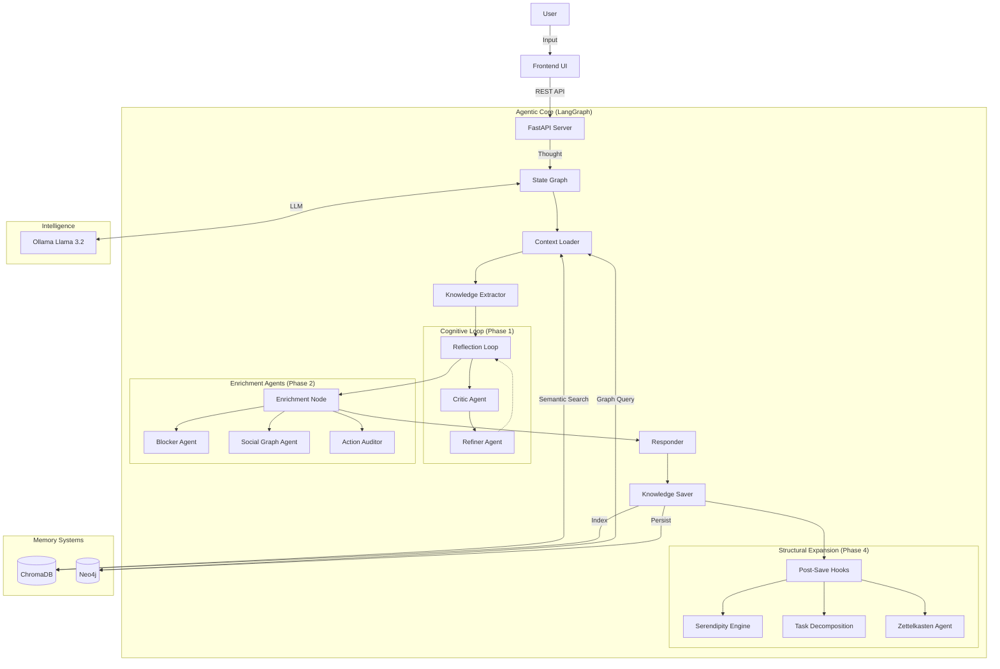

# Technical Architecture 🏗️

People's Agent uses a modern, retrieval-augmented **multi-agent architecture** derived from the "Second Brain" cognitive framework.

## System Diagram



## Agent Pipeline

The thought processing pipeline consists of multiple specialized agents:

### Phase 1: Cognitive Loop
| Agent | File | Purpose |
|-------|------|---------|
| **Context Loader** | `graph.py` | Semantic pre-fetch from ChromaDB + Neo4j |
| **Extractor** | `extraction_agents.py` | Extract entities, categories, summary |
| **Critic** | `extraction_agents.py` | Review extraction for missed connections |
| **Refiner** | `extraction_agents.py` | Improve extraction based on critique |

### Phase 2: Enrichment Agents
| Agent | File | Purpose |
|-------|------|---------|
| **Blocker Agent** | `enrichment_agents.py` | Detect risks, update project status |
| **Social Graph** | `enrichment_agents.py` | Match topics to people, suggest connections |
| **Action Auditor** | `enrichment_agents.py` | Extract implied tasks with urgency scores |

### Phase 3: Recursive Memory
| Agent | File | Purpose |
|-------|------|---------|
| **Spaced Repetition** | `knowledge_graph.py` | SM-2 algorithm for memory reinforcement |
| **Resurface Queue** | `server.py` | API endpoint for review cards |

### Phase 4: Structural Expansion
| Agent | File | Purpose |
|-------|------|---------|
| **Serendipity Engine** | `serendipity_agent.py` | Find structural holes, generate nudges |
| **Task Decomposition** | `task_decomposition_agent.py` | Parent → Child task hierarchy |
| **Zettelkasten** | `zettelkasten_agent.py` | Auto-atomize long-form content |

## Hybrid Memory System

| Type | Tool | Use Case |
|------|------|----------|
| **Vector RAG** | ChromaDB | Semantic similarity ("things like X") |
| **Graph RAG** | Neo4j | Relationship traversal (A→B→C) |

## Data Model

### Neo4j Schema
```
(:Thought)-[:MENTIONS]->(:Entity)
(:Thought)-[:BELONGS_TO]->(:Category)
(:Thought)-[:IMPLIES]->(:ActionItem)
(:Thought)-[:ATOMIZED_FROM]->(:Thought)
(:Task)-[:HAS_SUBTASK]->(:Task)
(:Entity)-[:HAS_PROFILE]->(:PersonProfile/:ProjectProfile)
```

### Key Node Types
- `Thought`: Raw note with content, summary, timestamp
- `Entity`: Person, Project, Topic, Tool, etc.
- `ActionItem`: Extracted task with urgency score
- `Task`: Hierarchical task with parent/child relationships

## API Endpoints

| Endpoint | Method | Purpose |
|----------|--------|---------|
| `/api/think` | POST | Process new thought |
| `/api/brain/insights` | GET | Dashboard data |
| `/api/resurface` | GET | Spaced repetition queue |
| `/api/serendipity` | GET | Structural hole nudges |
| `/api/radar` | GET | Project health metrics |
